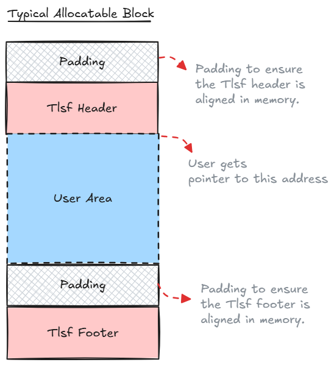

# Two-Level Segregated Fit (TLSF) Memory Allocator
[](https://github.com/aka411/tlsf-memory-allocator/actions/workflows/ci.yml)

This repository contains a high-performance, custom-built Two-Level Segregated Fit (TLSF) memory allocator implementation written in C++. The TLSF algorithm is optimized for low-latency, deterministic memory management, making it ideal for real-time and embedded systems.

## 📚 Table of Contents

1. [Design Overview](#design-overview)
    * [I. Memory Structures](#i-memory-structures)
        * [The Memory Pool Structure](#1-the-memory-pool-structure)
        * [Typical Allocatable Block](#2-typical-allocatable-block)
    * [II. The O(1) Lookup System](#ii-the-o1-lookup-system)
        * [Bitmaps for O(1) Lookup](#1-bitmaps-for-o1-lookup)
        * [Free List Array](#2-free-list-array)
2. [Core Operations](#core-operations)
    * [Allocation](#allocation)
    * [Deallocation](#deallocation)
3. [Key Features](#key-features)
4. [Performance Metrics](#performance-metrics)
5. [Prerequisites](#prerequisites)
6. [Build Instructions](#build-instructions)
7. [Usage Example](#usage-example)
8. [License](#license)
9. [Acknowledgements](#acknowledgements)
## Design Overview

The TLSF allocator manages a pre-allocated memory pool, organizing it into a series of blocks. Each block is prefixed with a header and suffixed with a footer to store metadata such as size and allocation status. The memory pool itself is bounded by unallocatable sentinel blocks at the beginning and end, which act as boundary markers.


### **I. Memory Structures**

#### **1. The Memory Pool Structure**

The entire memory pool is defined by special blocks at the beginning and end, which are not allocatable. These act as **sentinel blocks** or **boundary markers** for the allocator.


*The diagram above shows the structure of the start-of-pool marker.*


*The diagram above shows the structure of the end-of-pool marker.*


#### **2. Typical Allocatable Block**

When memory is requested, the allocator finds or creates a block of the required size. This block is what the user receives a pointer to. A typical allocated block has the following structure:

* **Tlsf Header & Footer:** These contain critical metadata about the block, such as its size and state (allocated or free).
* **User Area:** This is the actual memory that the user's application can use.
* **Padding:** Padding is often added to ensure that the header, footer, and user area are correctly aligned in memory. This is crucial for performance and preventing issues on certain architectures.



### **II. The O(1) Lookup System**

The core of the TLSF allocator's speed is its O(1) lookup system, which relies on a two-level hierarchy of bitmaps and free lists. The system is based on the find-first-set (FFS) operation, which efficiently locates the first set bit in a bitmask.

#### **1. Bitmaps for O(1) Lookup**

To quickly find a free block of a suitable size, the TLSF allocator uses two bitmaps. The Bitmaps are at the core of the allocator's performance. The indices we get from them are used to get the allocatable free block in O(1) time.

- **First-Level (FL) Bitmap:** A bit is set if at least one free block exists in the corresponding size class.

- **Second-Level (SL) Bitmap:** For each first-level group, a second bitmap tracks free blocks in more granular subclasses.

By using a find-first-set (FFS) operation on these bitmaps, the allocator can locate the appropriate free list in constant time, allowing for extremely fast allocation and deallocation.


#### **2. Free List Array**

The actual free blocks are maintained within doubly linked lists, and the head of each list is stored in a 2D array of pointers. The indices derived from the FL and SL bitmaps are used to directly access the head of the correct free list. The indices (FL and SL) are calculated such that the free block at the head of the chosen doubly linked list is guaranteed to be equal to or greater than the required size, enabling a direct, **O(1) constant-time** block selection without the need to traverse the list.


## Core Operations

### **Allocation**

1. Calculate required (FL,SL) indices from the requested size.

2. Use the bitmaps to find the smallest available free block.

3. Remove the block from its free list.

4. Mark it as allocated.

5. Split the block if it's much larger than the request, returning the remainder to the free lists.

### **Deallocation**
  
1. Mark the block as free.

2. Check adjacent blocks for a free state.

3. If an adjacent block is free, coalesce (merge) them into one larger free block to reduce external fragmentation.

4. Insert the new, possibly larger, block into the appropriate free list based on its new size.

## Key Features

* **Fast Allocation:** The two-level segregated list structure allows for quick searching of free blocks.
* **Hierarchical Free Lists:** Uses a two-level bitmap and a 2D array of pointers to quickly locate free blocks based on their size.
* **Minimal Fragmentation:** Adjacent free blocks are automatically coalesced (merged) to reduce external fragmentation.
* **Custom Memory Management:** Handles memory blocks with custom headers and footers to manage block metadata, including size and status.

## Performance Metrics
Benchmarking was done using Google Benchmark and you can see the code used to bench mark in `benchmark` folder.

### Important Note on Comparisons:

Comparing this TLSF allocator against the standard library malloc() (the system allocator) is not a fair comparison due to fundamental architectural differences:

* **Scope of Management:** This TLSF implementation manages its own pre-allocated memory pool and avoids all operating system overhead (like kernel system calls) during run-time allocation.

* **System Interaction:** The standard malloc() is designed for general-purpose high throughput and often has non-deterministic latency. While most small allocations are handled rapidly in user-space, `malloc()` must periodically rely on system calls (such as `brk/sbrk` or `mmap`) to acquire memory from the OS. These kernel operations cause significant, unpredictable overhead that a pre-allocated pool-based allocator is designed to eliminate.

* **Conclusion:** If this TLSF allocator were forced to make system calls for some memory request, its performance would also be substantially slower. The benefit of this allocator lies in its O(1) low-latency guarantees within its managed pool.

 **A fair comparison would be comparing it against other TLSF allocators or similar dedicated pool-based, low-latency allocators.**
 


### Output Files

* [Download Raw Benchmark Data (JSON)](https://aka411.github.io/tlsf-memory-allocator/data/benchmark_result.json)

## Prerequisites

To build and run this project, you will need the following tools and dependencies installed on your system.

* **C++ Toolchain:** A modern C++ compiler supporting the **C++17** standard or newer (e.g., GCC, Clang, or MSVC).
* **Build System:** [CMake](https://cmake.org/download/) (Minimum Required Version: **3.14**) is used as the meta-build system to generate native build files.

## Build Instructions
### 🧪 Quick Validation: Build and Test

To demonstrate the allocator's functionality and correctness, the entire test suite can be executed locally using CTest.

1.  **Clone the Repository:**
    ```bash
    git clone https://github.com/aka411/tlsf-memory-allocator.git
    cd tlsf-memory-allocator
    ```
2.  **Build the Project:** (This compiles the allocator, the test executable, and the demo executable)
    ```bash
    cmake -B build
    cmake --build build
    ```
3.  **Run All Tests:** (This executes the tests using CTest)
    ```bash
    cd build
    ctest --verbose
    ```
    *All tests must pass for a successful validation.*


### 🏃 Run the Live Demo

To quickly see the allocator's public API in action and verify its performance claims (e.g., $\mathcal{O}(1)$ speed), run the compiled demo application.

1.  Ensure you have completed the **Build the Project** step above.
2.  **Execute the Demo:** 
    ```bash
    ./build/bin/demo-app
    ```
    *The demo will print performance metrics to the console.*


## Usage Example
Here is a simple example demonstrating how to initialize the allocator and use it.
```cpp
#include "tlsf.h"
#include <iostream>

int main()
{

	TlsfAllocator tlsfAllocator(1024);// Get 1KB of memory for the pool

	void* ptr = tlsfAllocator.allocate(200); // get a pointer to block of size 200 bytes

	if(ptr != nullptr)
	{
		std::cout<< "Successfully allocated 200 bytes of memory"<<std::endl;
		tlsfAllocator.deallocate(ptr);
	}
	else
	{
		std::cout<< "Failed to allocat 200 bytes of memory"<<std::endl;

	}
	std::cout << "Press Enter key to Exit" << std::endl;
	std::cin.get();// wait for user to press enter to avoid exiting fast

	return 0;
}

```

## License
This project is licensed under the Apache-2.0 License - see the LICENSE file for details.

## Acknowledgements

Thanks for these awesome resources that were used during the development.
* **[TLSF: a New Dynamic Memory Allocator for Real-Time Systems](http://www.gii.upv.es/tlsf/files/papers/ecrts04_tlsf.pdf):** This is the original research paper by M. Masmano; I. Ripoll; A. Crespo; J. Real that introduced the Two-Level Segregated Fit algorithm, providing the foundational concepts for O(1) constant-time memory management.

* **[Two-Level Segregated Fit Memory Allocator (Rice Fields)](https://ricefields.me/2024/04/20/tlsf-allocator.html):** Provided a detailed explanation and implementation guidance on the two-level binning system, including the linear-log bucketing approach.
